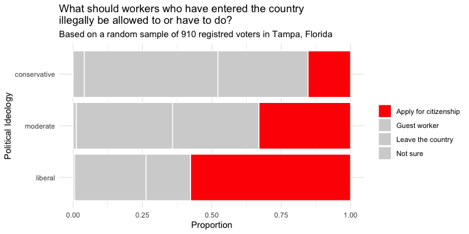

# KEY Tutorial 3: EDA with Categorical Data
Mr. Adams

- [EDA with Categorical Data](#eda-with-categorical-data)
- [Libraries](#libraries)
- [1: Exploring One Categorical
  Variable](#exploring-one-categorical-variable)
  - [1.1 Data for Part One](#data-for-part-one)
    - [1.1: Tasks and Questions](#tasks-and-questions)
  - [1.2 Build a table](#build-a-table)
    - [1.2 Tasks and Questions](#tasks-and-questions-1)
  - [1.3 Table with Proportions and
    Counts](#table-with-proportions-and-counts)
    - [1.3 Tasks and Questions](#tasks-and-questions-2)
  - [1.4 Arranging the table](#arranging-the-table)
    - [1.4 Tasks and Questions](#tasks-and-questions-3)
  - [1.5: Build a Bar Graph](#build-a-bar-graph)
    - [1.5 Tasks and Questions](#tasks-and-questions-4)
  - [1.6: Adjust bar graph to implement some data visualizations best
    practices.](#adjust-bar-graph-to-implement-some-data-visualizations-best-practices.)
    - [1.6a: Horizontal Bars and Labels](#a-horizontal-bars-and-labels)
    - [1.6b: Arranging the bars and changing
      colors](#b-arranging-the-bars-and-changing-colors)
- [2: Exploring Two Categorical
  Variables](#exploring-two-categorical-variables)
  - [2.1: Contingency Table with Counts](#contingency-table-with-counts)
    - [2.1: Tasks and Questions](#tasks-and-questions-5)
  - [2.2: Contingency Table with
    Proportions.](#contingency-table-with-proportions.)
    - [2.2: Tasks and Questions](#tasks-and-questions-6)
  - [2.3: Visualize Two Categorical Variables with a Filled Bar
    Plot](#visualize-two-categorical-variables-with-a-filled-bar-plot)
    - [2.3a: Create a Filled Bar Graph](#a-create-a-filled-bar-graph)
    - [2.3b Adjust filled bar graph to include some data visualization
      best
      practices](#b-adjust-filled-bar-graph-to-include-some-data-visualization-best-practices)

# EDA with Categorical Data

# Libraries

``` r
library(tidyverse)
library(openintro)
library(janitor)
library(knitr)
library(kableExtra)
library(gridExtra)
library(readr)
library(gt)
```

# 1: Exploring One Categorical Variable

## 1.1 Data for Part One

To learn how you can explore one categorical variable using R, you will
use the data in the `openintro` packaged called `immigration`.

[Click here to read a description of the
dataset.](http://openintrostat.github.io/openintro/reference/immigration.html)

### 1.1: Tasks and Questions

1.  Without running the code below, read the code and write down what
    the name of the data frame will be. (Be sure to type the name
    EXACTLY as it appears in the code)

    `immigration`

2.  What are the observational units?

    “910 randomly sampled registered voters in Tampa, FL”

3.  How many observations are there? (You can now run the code to help
    answer this question.)

    910

4.  List the two variables included in this data frame. Be sure to list
    the name of the variable exactly as it appears and label the type of
    each variable.

    `political`

    `response`

``` r
# View it and take a glimpse of it.

view(immigration)

glimpse(immigration)
```

    Rows: 910
    Columns: 2
    $ response  <fct> Apply for citizenship, Apply for citizenship, Apply for citi…
    $ political <fct> conservative, conservative, conservative, conservative, cons…

## 1.2 Build a table

Now that you have an understanding of the data, let’s start exploring.

To begin, we will ask a question:

**How many of the survey respondents described themselves as having a
political ideology of either conservative, liberal, or moderate?**

Obviously, we are not going to look at the data and get our answer by
counting by hand! What a waste of time! One thing we could do is tell
the computer to build a table for us! The structure of the code required
to make a table will read like this:

Look at this data called immigration AND THEN count the number of items
for each level in this categorical variable.

### 1.2 Tasks and Questions

1.  Based on the description above that details the structure of the
    code, erase the `______` sections in the code chunk below and
    replace them with either the *name of the data set* or *the name of
    the variable* needed to answer our question.

2.  Which political ideology had the most respondents? How many did they
    have?

    372 respondents to this poll identified as having a conservative
    political ideology.

``` r
immigration |>
  count(political)
```

    # A tibble: 3 × 2
      political        n
      <fct>        <int>
    1 conservative   372
    2 liberal        175
    3 moderate       363

## 1.3 Table with Proportions and Counts

Knowing the total in each group is helpful. Knowing what proportion of
respondents fell into each level can also be helpful. To get that
information you have to add one line of code to what you wrote in part
1.2.

That line of code is what you see in the gray space below. The mutate
function in that line is creating a new variable called proportion that
takes the number of respondents in each level and divides each of those
by the total number of respondents.

### 1.3 Tasks and Questions

1.  Copy the code you wrote in part 1.2 into the line above the code you
    see below.

2.  Add the pipe symbol, `|>`, at the end of the line that has `count`.

3.  Run the code.

4.  What proportion of the respondents identified themselves as
    moderate?

    Respondents who identified themselves as moderates made up roughly
    39.9% of the entire sample.

5.  **(BONUS)** Add a new variable to this data frame that shows the
    percentage of respondents for each political ideology.

``` r
immigration |>
  count(political) |>
  mutate(proportion = n / sum(n)) |>
  mutate(percentage = proportion*100) |>
  gt()
```

<div id="qjvrvfmown" style="padding-left:0px;padding-right:0px;padding-top:10px;padding-bottom:10px;overflow-x:auto;overflow-y:auto;width:auto;height:auto;">
<style>#qjvrvfmown table {
  font-family: system-ui, 'Segoe UI', Roboto, Helvetica, Arial, sans-serif, 'Apple Color Emoji', 'Segoe UI Emoji', 'Segoe UI Symbol', 'Noto Color Emoji';
  -webkit-font-smoothing: antialiased;
  -moz-osx-font-smoothing: grayscale;
}
&#10;#qjvrvfmown thead, #qjvrvfmown tbody, #qjvrvfmown tfoot, #qjvrvfmown tr, #qjvrvfmown td, #qjvrvfmown th {
  border-style: none;
}
&#10;#qjvrvfmown p {
  margin: 0;
  padding: 0;
}
&#10;#qjvrvfmown .gt_table {
  display: table;
  border-collapse: collapse;
  line-height: normal;
  margin-left: auto;
  margin-right: auto;
  color: #333333;
  font-size: 16px;
  font-weight: normal;
  font-style: normal;
  background-color: #FFFFFF;
  width: auto;
  border-top-style: solid;
  border-top-width: 2px;
  border-top-color: #A8A8A8;
  border-right-style: none;
  border-right-width: 2px;
  border-right-color: #D3D3D3;
  border-bottom-style: solid;
  border-bottom-width: 2px;
  border-bottom-color: #A8A8A8;
  border-left-style: none;
  border-left-width: 2px;
  border-left-color: #D3D3D3;
}
&#10;#qjvrvfmown .gt_caption {
  padding-top: 4px;
  padding-bottom: 4px;
}
&#10;#qjvrvfmown .gt_title {
  color: #333333;
  font-size: 125%;
  font-weight: initial;
  padding-top: 4px;
  padding-bottom: 4px;
  padding-left: 5px;
  padding-right: 5px;
  border-bottom-color: #FFFFFF;
  border-bottom-width: 0;
}
&#10;#qjvrvfmown .gt_subtitle {
  color: #333333;
  font-size: 85%;
  font-weight: initial;
  padding-top: 3px;
  padding-bottom: 5px;
  padding-left: 5px;
  padding-right: 5px;
  border-top-color: #FFFFFF;
  border-top-width: 0;
}
&#10;#qjvrvfmown .gt_heading {
  background-color: #FFFFFF;
  text-align: center;
  border-bottom-color: #FFFFFF;
  border-left-style: none;
  border-left-width: 1px;
  border-left-color: #D3D3D3;
  border-right-style: none;
  border-right-width: 1px;
  border-right-color: #D3D3D3;
}
&#10;#qjvrvfmown .gt_bottom_border {
  border-bottom-style: solid;
  border-bottom-width: 2px;
  border-bottom-color: #D3D3D3;
}
&#10;#qjvrvfmown .gt_col_headings {
  border-top-style: solid;
  border-top-width: 2px;
  border-top-color: #D3D3D3;
  border-bottom-style: solid;
  border-bottom-width: 2px;
  border-bottom-color: #D3D3D3;
  border-left-style: none;
  border-left-width: 1px;
  border-left-color: #D3D3D3;
  border-right-style: none;
  border-right-width: 1px;
  border-right-color: #D3D3D3;
}
&#10;#qjvrvfmown .gt_col_heading {
  color: #333333;
  background-color: #FFFFFF;
  font-size: 100%;
  font-weight: normal;
  text-transform: inherit;
  border-left-style: none;
  border-left-width: 1px;
  border-left-color: #D3D3D3;
  border-right-style: none;
  border-right-width: 1px;
  border-right-color: #D3D3D3;
  vertical-align: bottom;
  padding-top: 5px;
  padding-bottom: 6px;
  padding-left: 5px;
  padding-right: 5px;
  overflow-x: hidden;
}
&#10;#qjvrvfmown .gt_column_spanner_outer {
  color: #333333;
  background-color: #FFFFFF;
  font-size: 100%;
  font-weight: normal;
  text-transform: inherit;
  padding-top: 0;
  padding-bottom: 0;
  padding-left: 4px;
  padding-right: 4px;
}
&#10;#qjvrvfmown .gt_column_spanner_outer:first-child {
  padding-left: 0;
}
&#10;#qjvrvfmown .gt_column_spanner_outer:last-child {
  padding-right: 0;
}
&#10;#qjvrvfmown .gt_column_spanner {
  border-bottom-style: solid;
  border-bottom-width: 2px;
  border-bottom-color: #D3D3D3;
  vertical-align: bottom;
  padding-top: 5px;
  padding-bottom: 5px;
  overflow-x: hidden;
  display: inline-block;
  width: 100%;
}
&#10;#qjvrvfmown .gt_spanner_row {
  border-bottom-style: hidden;
}
&#10;#qjvrvfmown .gt_group_heading {
  padding-top: 8px;
  padding-bottom: 8px;
  padding-left: 5px;
  padding-right: 5px;
  color: #333333;
  background-color: #FFFFFF;
  font-size: 100%;
  font-weight: initial;
  text-transform: inherit;
  border-top-style: solid;
  border-top-width: 2px;
  border-top-color: #D3D3D3;
  border-bottom-style: solid;
  border-bottom-width: 2px;
  border-bottom-color: #D3D3D3;
  border-left-style: none;
  border-left-width: 1px;
  border-left-color: #D3D3D3;
  border-right-style: none;
  border-right-width: 1px;
  border-right-color: #D3D3D3;
  vertical-align: middle;
  text-align: left;
}
&#10;#qjvrvfmown .gt_empty_group_heading {
  padding: 0.5px;
  color: #333333;
  background-color: #FFFFFF;
  font-size: 100%;
  font-weight: initial;
  border-top-style: solid;
  border-top-width: 2px;
  border-top-color: #D3D3D3;
  border-bottom-style: solid;
  border-bottom-width: 2px;
  border-bottom-color: #D3D3D3;
  vertical-align: middle;
}
&#10;#qjvrvfmown .gt_from_md > :first-child {
  margin-top: 0;
}
&#10;#qjvrvfmown .gt_from_md > :last-child {
  margin-bottom: 0;
}
&#10;#qjvrvfmown .gt_row {
  padding-top: 8px;
  padding-bottom: 8px;
  padding-left: 5px;
  padding-right: 5px;
  margin: 10px;
  border-top-style: solid;
  border-top-width: 1px;
  border-top-color: #D3D3D3;
  border-left-style: none;
  border-left-width: 1px;
  border-left-color: #D3D3D3;
  border-right-style: none;
  border-right-width: 1px;
  border-right-color: #D3D3D3;
  vertical-align: middle;
  overflow-x: hidden;
}
&#10;#qjvrvfmown .gt_stub {
  color: #333333;
  background-color: #FFFFFF;
  font-size: 100%;
  font-weight: initial;
  text-transform: inherit;
  border-right-style: solid;
  border-right-width: 2px;
  border-right-color: #D3D3D3;
  padding-left: 5px;
  padding-right: 5px;
}
&#10;#qjvrvfmown .gt_stub_row_group {
  color: #333333;
  background-color: #FFFFFF;
  font-size: 100%;
  font-weight: initial;
  text-transform: inherit;
  border-right-style: solid;
  border-right-width: 2px;
  border-right-color: #D3D3D3;
  padding-left: 5px;
  padding-right: 5px;
  vertical-align: top;
}
&#10;#qjvrvfmown .gt_row_group_first td {
  border-top-width: 2px;
}
&#10;#qjvrvfmown .gt_row_group_first th {
  border-top-width: 2px;
}
&#10;#qjvrvfmown .gt_summary_row {
  color: #333333;
  background-color: #FFFFFF;
  text-transform: inherit;
  padding-top: 8px;
  padding-bottom: 8px;
  padding-left: 5px;
  padding-right: 5px;
}
&#10;#qjvrvfmown .gt_first_summary_row {
  border-top-style: solid;
  border-top-color: #D3D3D3;
}
&#10;#qjvrvfmown .gt_first_summary_row.thick {
  border-top-width: 2px;
}
&#10;#qjvrvfmown .gt_last_summary_row {
  padding-top: 8px;
  padding-bottom: 8px;
  padding-left: 5px;
  padding-right: 5px;
  border-bottom-style: solid;
  border-bottom-width: 2px;
  border-bottom-color: #D3D3D3;
}
&#10;#qjvrvfmown .gt_grand_summary_row {
  color: #333333;
  background-color: #FFFFFF;
  text-transform: inherit;
  padding-top: 8px;
  padding-bottom: 8px;
  padding-left: 5px;
  padding-right: 5px;
}
&#10;#qjvrvfmown .gt_first_grand_summary_row {
  padding-top: 8px;
  padding-bottom: 8px;
  padding-left: 5px;
  padding-right: 5px;
  border-top-style: double;
  border-top-width: 6px;
  border-top-color: #D3D3D3;
}
&#10;#qjvrvfmown .gt_last_grand_summary_row_top {
  padding-top: 8px;
  padding-bottom: 8px;
  padding-left: 5px;
  padding-right: 5px;
  border-bottom-style: double;
  border-bottom-width: 6px;
  border-bottom-color: #D3D3D3;
}
&#10;#qjvrvfmown .gt_striped {
  background-color: rgba(128, 128, 128, 0.05);
}
&#10;#qjvrvfmown .gt_table_body {
  border-top-style: solid;
  border-top-width: 2px;
  border-top-color: #D3D3D3;
  border-bottom-style: solid;
  border-bottom-width: 2px;
  border-bottom-color: #D3D3D3;
}
&#10;#qjvrvfmown .gt_footnotes {
  color: #333333;
  background-color: #FFFFFF;
  border-bottom-style: none;
  border-bottom-width: 2px;
  border-bottom-color: #D3D3D3;
  border-left-style: none;
  border-left-width: 2px;
  border-left-color: #D3D3D3;
  border-right-style: none;
  border-right-width: 2px;
  border-right-color: #D3D3D3;
}
&#10;#qjvrvfmown .gt_footnote {
  margin: 0px;
  font-size: 90%;
  padding-top: 4px;
  padding-bottom: 4px;
  padding-left: 5px;
  padding-right: 5px;
}
&#10;#qjvrvfmown .gt_sourcenotes {
  color: #333333;
  background-color: #FFFFFF;
  border-bottom-style: none;
  border-bottom-width: 2px;
  border-bottom-color: #D3D3D3;
  border-left-style: none;
  border-left-width: 2px;
  border-left-color: #D3D3D3;
  border-right-style: none;
  border-right-width: 2px;
  border-right-color: #D3D3D3;
}
&#10;#qjvrvfmown .gt_sourcenote {
  font-size: 90%;
  padding-top: 4px;
  padding-bottom: 4px;
  padding-left: 5px;
  padding-right: 5px;
}
&#10;#qjvrvfmown .gt_left {
  text-align: left;
}
&#10;#qjvrvfmown .gt_center {
  text-align: center;
}
&#10;#qjvrvfmown .gt_right {
  text-align: right;
  font-variant-numeric: tabular-nums;
}
&#10;#qjvrvfmown .gt_font_normal {
  font-weight: normal;
}
&#10;#qjvrvfmown .gt_font_bold {
  font-weight: bold;
}
&#10;#qjvrvfmown .gt_font_italic {
  font-style: italic;
}
&#10;#qjvrvfmown .gt_super {
  font-size: 65%;
}
&#10;#qjvrvfmown .gt_footnote_marks {
  font-size: 75%;
  vertical-align: 0.4em;
  position: initial;
}
&#10;#qjvrvfmown .gt_asterisk {
  font-size: 100%;
  vertical-align: 0;
}
&#10;#qjvrvfmown .gt_indent_1 {
  text-indent: 5px;
}
&#10;#qjvrvfmown .gt_indent_2 {
  text-indent: 10px;
}
&#10;#qjvrvfmown .gt_indent_3 {
  text-indent: 15px;
}
&#10;#qjvrvfmown .gt_indent_4 {
  text-indent: 20px;
}
&#10;#qjvrvfmown .gt_indent_5 {
  text-indent: 25px;
}
</style>
<table class="gt_table" data-quarto-disable-processing="false" data-quarto-bootstrap="false">
  <thead>
    &#10;    <tr class="gt_col_headings">
      <th class="gt_col_heading gt_columns_bottom_border gt_center" rowspan="1" colspan="1" scope="col" id="political">political</th>
      <th class="gt_col_heading gt_columns_bottom_border gt_right" rowspan="1" colspan="1" scope="col" id="n">n</th>
      <th class="gt_col_heading gt_columns_bottom_border gt_right" rowspan="1" colspan="1" scope="col" id="proportion">proportion</th>
      <th class="gt_col_heading gt_columns_bottom_border gt_right" rowspan="1" colspan="1" scope="col" id="percentage">percentage</th>
    </tr>
  </thead>
  <tbody class="gt_table_body">
    <tr><td headers="political" class="gt_row gt_center">conservative</td>
<td headers="n" class="gt_row gt_right">372</td>
<td headers="proportion" class="gt_row gt_right">0.4087912</td>
<td headers="percentage" class="gt_row gt_right">40.87912</td></tr>
    <tr><td headers="political" class="gt_row gt_center">liberal</td>
<td headers="n" class="gt_row gt_right">175</td>
<td headers="proportion" class="gt_row gt_right">0.1923077</td>
<td headers="percentage" class="gt_row gt_right">19.23077</td></tr>
    <tr><td headers="political" class="gt_row gt_center">moderate</td>
<td headers="n" class="gt_row gt_right">363</td>
<td headers="proportion" class="gt_row gt_right">0.3989011</td>
<td headers="percentage" class="gt_row gt_right">39.89011</td></tr>
  </tbody>
  &#10;  
</table>
</div>

## 1.4 Arranging the table

We’ve talked a lot about clear and effective communication. One way to
do that when making a table is by arranging the table in a meaningful
way. The political ideology variable is not ordinal so we can order the
table from least to greatest or greatest to least. Again, adding one
line of code to what we’ve already created will do just that.

### 1.4 Tasks and Questions

1.  Copy the code from part 1.3 and paste it into the gray space below.

2.  Add a pipe symbol, `|>`, after the row that includes mutate.

3.  In the next line of code add: `arrange(desc(proportion))`

4.  Run the entire code chunk.

5.  What do you think `desc`, which is in the line of code your wrote,
    stands for?

``` r
immigration |>
  count(political) |>
  mutate(proportion = n / sum(n)) |> 
  arrange(desc(proportion)) |>
  gt()
```

<div id="qimghhpzks" style="padding-left:0px;padding-right:0px;padding-top:10px;padding-bottom:10px;overflow-x:auto;overflow-y:auto;width:auto;height:auto;">
<style>#qimghhpzks table {
  font-family: system-ui, 'Segoe UI', Roboto, Helvetica, Arial, sans-serif, 'Apple Color Emoji', 'Segoe UI Emoji', 'Segoe UI Symbol', 'Noto Color Emoji';
  -webkit-font-smoothing: antialiased;
  -moz-osx-font-smoothing: grayscale;
}
&#10;#qimghhpzks thead, #qimghhpzks tbody, #qimghhpzks tfoot, #qimghhpzks tr, #qimghhpzks td, #qimghhpzks th {
  border-style: none;
}
&#10;#qimghhpzks p {
  margin: 0;
  padding: 0;
}
&#10;#qimghhpzks .gt_table {
  display: table;
  border-collapse: collapse;
  line-height: normal;
  margin-left: auto;
  margin-right: auto;
  color: #333333;
  font-size: 16px;
  font-weight: normal;
  font-style: normal;
  background-color: #FFFFFF;
  width: auto;
  border-top-style: solid;
  border-top-width: 2px;
  border-top-color: #A8A8A8;
  border-right-style: none;
  border-right-width: 2px;
  border-right-color: #D3D3D3;
  border-bottom-style: solid;
  border-bottom-width: 2px;
  border-bottom-color: #A8A8A8;
  border-left-style: none;
  border-left-width: 2px;
  border-left-color: #D3D3D3;
}
&#10;#qimghhpzks .gt_caption {
  padding-top: 4px;
  padding-bottom: 4px;
}
&#10;#qimghhpzks .gt_title {
  color: #333333;
  font-size: 125%;
  font-weight: initial;
  padding-top: 4px;
  padding-bottom: 4px;
  padding-left: 5px;
  padding-right: 5px;
  border-bottom-color: #FFFFFF;
  border-bottom-width: 0;
}
&#10;#qimghhpzks .gt_subtitle {
  color: #333333;
  font-size: 85%;
  font-weight: initial;
  padding-top: 3px;
  padding-bottom: 5px;
  padding-left: 5px;
  padding-right: 5px;
  border-top-color: #FFFFFF;
  border-top-width: 0;
}
&#10;#qimghhpzks .gt_heading {
  background-color: #FFFFFF;
  text-align: center;
  border-bottom-color: #FFFFFF;
  border-left-style: none;
  border-left-width: 1px;
  border-left-color: #D3D3D3;
  border-right-style: none;
  border-right-width: 1px;
  border-right-color: #D3D3D3;
}
&#10;#qimghhpzks .gt_bottom_border {
  border-bottom-style: solid;
  border-bottom-width: 2px;
  border-bottom-color: #D3D3D3;
}
&#10;#qimghhpzks .gt_col_headings {
  border-top-style: solid;
  border-top-width: 2px;
  border-top-color: #D3D3D3;
  border-bottom-style: solid;
  border-bottom-width: 2px;
  border-bottom-color: #D3D3D3;
  border-left-style: none;
  border-left-width: 1px;
  border-left-color: #D3D3D3;
  border-right-style: none;
  border-right-width: 1px;
  border-right-color: #D3D3D3;
}
&#10;#qimghhpzks .gt_col_heading {
  color: #333333;
  background-color: #FFFFFF;
  font-size: 100%;
  font-weight: normal;
  text-transform: inherit;
  border-left-style: none;
  border-left-width: 1px;
  border-left-color: #D3D3D3;
  border-right-style: none;
  border-right-width: 1px;
  border-right-color: #D3D3D3;
  vertical-align: bottom;
  padding-top: 5px;
  padding-bottom: 6px;
  padding-left: 5px;
  padding-right: 5px;
  overflow-x: hidden;
}
&#10;#qimghhpzks .gt_column_spanner_outer {
  color: #333333;
  background-color: #FFFFFF;
  font-size: 100%;
  font-weight: normal;
  text-transform: inherit;
  padding-top: 0;
  padding-bottom: 0;
  padding-left: 4px;
  padding-right: 4px;
}
&#10;#qimghhpzks .gt_column_spanner_outer:first-child {
  padding-left: 0;
}
&#10;#qimghhpzks .gt_column_spanner_outer:last-child {
  padding-right: 0;
}
&#10;#qimghhpzks .gt_column_spanner {
  border-bottom-style: solid;
  border-bottom-width: 2px;
  border-bottom-color: #D3D3D3;
  vertical-align: bottom;
  padding-top: 5px;
  padding-bottom: 5px;
  overflow-x: hidden;
  display: inline-block;
  width: 100%;
}
&#10;#qimghhpzks .gt_spanner_row {
  border-bottom-style: hidden;
}
&#10;#qimghhpzks .gt_group_heading {
  padding-top: 8px;
  padding-bottom: 8px;
  padding-left: 5px;
  padding-right: 5px;
  color: #333333;
  background-color: #FFFFFF;
  font-size: 100%;
  font-weight: initial;
  text-transform: inherit;
  border-top-style: solid;
  border-top-width: 2px;
  border-top-color: #D3D3D3;
  border-bottom-style: solid;
  border-bottom-width: 2px;
  border-bottom-color: #D3D3D3;
  border-left-style: none;
  border-left-width: 1px;
  border-left-color: #D3D3D3;
  border-right-style: none;
  border-right-width: 1px;
  border-right-color: #D3D3D3;
  vertical-align: middle;
  text-align: left;
}
&#10;#qimghhpzks .gt_empty_group_heading {
  padding: 0.5px;
  color: #333333;
  background-color: #FFFFFF;
  font-size: 100%;
  font-weight: initial;
  border-top-style: solid;
  border-top-width: 2px;
  border-top-color: #D3D3D3;
  border-bottom-style: solid;
  border-bottom-width: 2px;
  border-bottom-color: #D3D3D3;
  vertical-align: middle;
}
&#10;#qimghhpzks .gt_from_md > :first-child {
  margin-top: 0;
}
&#10;#qimghhpzks .gt_from_md > :last-child {
  margin-bottom: 0;
}
&#10;#qimghhpzks .gt_row {
  padding-top: 8px;
  padding-bottom: 8px;
  padding-left: 5px;
  padding-right: 5px;
  margin: 10px;
  border-top-style: solid;
  border-top-width: 1px;
  border-top-color: #D3D3D3;
  border-left-style: none;
  border-left-width: 1px;
  border-left-color: #D3D3D3;
  border-right-style: none;
  border-right-width: 1px;
  border-right-color: #D3D3D3;
  vertical-align: middle;
  overflow-x: hidden;
}
&#10;#qimghhpzks .gt_stub {
  color: #333333;
  background-color: #FFFFFF;
  font-size: 100%;
  font-weight: initial;
  text-transform: inherit;
  border-right-style: solid;
  border-right-width: 2px;
  border-right-color: #D3D3D3;
  padding-left: 5px;
  padding-right: 5px;
}
&#10;#qimghhpzks .gt_stub_row_group {
  color: #333333;
  background-color: #FFFFFF;
  font-size: 100%;
  font-weight: initial;
  text-transform: inherit;
  border-right-style: solid;
  border-right-width: 2px;
  border-right-color: #D3D3D3;
  padding-left: 5px;
  padding-right: 5px;
  vertical-align: top;
}
&#10;#qimghhpzks .gt_row_group_first td {
  border-top-width: 2px;
}
&#10;#qimghhpzks .gt_row_group_first th {
  border-top-width: 2px;
}
&#10;#qimghhpzks .gt_summary_row {
  color: #333333;
  background-color: #FFFFFF;
  text-transform: inherit;
  padding-top: 8px;
  padding-bottom: 8px;
  padding-left: 5px;
  padding-right: 5px;
}
&#10;#qimghhpzks .gt_first_summary_row {
  border-top-style: solid;
  border-top-color: #D3D3D3;
}
&#10;#qimghhpzks .gt_first_summary_row.thick {
  border-top-width: 2px;
}
&#10;#qimghhpzks .gt_last_summary_row {
  padding-top: 8px;
  padding-bottom: 8px;
  padding-left: 5px;
  padding-right: 5px;
  border-bottom-style: solid;
  border-bottom-width: 2px;
  border-bottom-color: #D3D3D3;
}
&#10;#qimghhpzks .gt_grand_summary_row {
  color: #333333;
  background-color: #FFFFFF;
  text-transform: inherit;
  padding-top: 8px;
  padding-bottom: 8px;
  padding-left: 5px;
  padding-right: 5px;
}
&#10;#qimghhpzks .gt_first_grand_summary_row {
  padding-top: 8px;
  padding-bottom: 8px;
  padding-left: 5px;
  padding-right: 5px;
  border-top-style: double;
  border-top-width: 6px;
  border-top-color: #D3D3D3;
}
&#10;#qimghhpzks .gt_last_grand_summary_row_top {
  padding-top: 8px;
  padding-bottom: 8px;
  padding-left: 5px;
  padding-right: 5px;
  border-bottom-style: double;
  border-bottom-width: 6px;
  border-bottom-color: #D3D3D3;
}
&#10;#qimghhpzks .gt_striped {
  background-color: rgba(128, 128, 128, 0.05);
}
&#10;#qimghhpzks .gt_table_body {
  border-top-style: solid;
  border-top-width: 2px;
  border-top-color: #D3D3D3;
  border-bottom-style: solid;
  border-bottom-width: 2px;
  border-bottom-color: #D3D3D3;
}
&#10;#qimghhpzks .gt_footnotes {
  color: #333333;
  background-color: #FFFFFF;
  border-bottom-style: none;
  border-bottom-width: 2px;
  border-bottom-color: #D3D3D3;
  border-left-style: none;
  border-left-width: 2px;
  border-left-color: #D3D3D3;
  border-right-style: none;
  border-right-width: 2px;
  border-right-color: #D3D3D3;
}
&#10;#qimghhpzks .gt_footnote {
  margin: 0px;
  font-size: 90%;
  padding-top: 4px;
  padding-bottom: 4px;
  padding-left: 5px;
  padding-right: 5px;
}
&#10;#qimghhpzks .gt_sourcenotes {
  color: #333333;
  background-color: #FFFFFF;
  border-bottom-style: none;
  border-bottom-width: 2px;
  border-bottom-color: #D3D3D3;
  border-left-style: none;
  border-left-width: 2px;
  border-left-color: #D3D3D3;
  border-right-style: none;
  border-right-width: 2px;
  border-right-color: #D3D3D3;
}
&#10;#qimghhpzks .gt_sourcenote {
  font-size: 90%;
  padding-top: 4px;
  padding-bottom: 4px;
  padding-left: 5px;
  padding-right: 5px;
}
&#10;#qimghhpzks .gt_left {
  text-align: left;
}
&#10;#qimghhpzks .gt_center {
  text-align: center;
}
&#10;#qimghhpzks .gt_right {
  text-align: right;
  font-variant-numeric: tabular-nums;
}
&#10;#qimghhpzks .gt_font_normal {
  font-weight: normal;
}
&#10;#qimghhpzks .gt_font_bold {
  font-weight: bold;
}
&#10;#qimghhpzks .gt_font_italic {
  font-style: italic;
}
&#10;#qimghhpzks .gt_super {
  font-size: 65%;
}
&#10;#qimghhpzks .gt_footnote_marks {
  font-size: 75%;
  vertical-align: 0.4em;
  position: initial;
}
&#10;#qimghhpzks .gt_asterisk {
  font-size: 100%;
  vertical-align: 0;
}
&#10;#qimghhpzks .gt_indent_1 {
  text-indent: 5px;
}
&#10;#qimghhpzks .gt_indent_2 {
  text-indent: 10px;
}
&#10;#qimghhpzks .gt_indent_3 {
  text-indent: 15px;
}
&#10;#qimghhpzks .gt_indent_4 {
  text-indent: 20px;
}
&#10;#qimghhpzks .gt_indent_5 {
  text-indent: 25px;
}
</style>
<table class="gt_table" data-quarto-disable-processing="false" data-quarto-bootstrap="false">
  <thead>
    &#10;    <tr class="gt_col_headings">
      <th class="gt_col_heading gt_columns_bottom_border gt_center" rowspan="1" colspan="1" scope="col" id="political">political</th>
      <th class="gt_col_heading gt_columns_bottom_border gt_right" rowspan="1" colspan="1" scope="col" id="n">n</th>
      <th class="gt_col_heading gt_columns_bottom_border gt_right" rowspan="1" colspan="1" scope="col" id="proportion">proportion</th>
    </tr>
  </thead>
  <tbody class="gt_table_body">
    <tr><td headers="political" class="gt_row gt_center">conservative</td>
<td headers="n" class="gt_row gt_right">372</td>
<td headers="proportion" class="gt_row gt_right">0.4087912</td></tr>
    <tr><td headers="political" class="gt_row gt_center">moderate</td>
<td headers="n" class="gt_row gt_right">363</td>
<td headers="proportion" class="gt_row gt_right">0.3989011</td></tr>
    <tr><td headers="political" class="gt_row gt_center">liberal</td>
<td headers="n" class="gt_row gt_right">175</td>
<td headers="proportion" class="gt_row gt_right">0.1923077</td></tr>
  </tbody>
  &#10;  
</table>
</div>

## 1.5: Build a Bar Graph

After building the table, you now have a better understanding of the
respondents to the survey. The table could be used as a visualization.
However, often times people can more easily and quickly see the major
takeaways from a bar graph. The table would then provide you with the
numbers to support what is displayed in the bar graph.

We will now build a bar graph that shows what is in the table you just
created. The structure of the code to do this will look very similar to
the code you wrote to make histograms and density curves in the previous
tutorial.

To answer this question…

- I need this data frame and then

- I specifically want to make a plot with this variable and need to put
  it on the blank axis and

- create this visualization.

### 1.5 Tasks and Questions

1.  Change `NAME_OF_DATA_FRAME` and `CATEGORICAL_VARIABLE` so you create
    a bar graph that visualizes the same information you created in 1.2.

2.  Run the code.

3.  What are three design changes you’d like to make to this
    visualization to make it easier for someone to read?

    Order the bars from greatest to least.

    Add a title and subtitle.

    Improve the labels on each axis.

    Make the bars extend horizontally instead of vertically.

``` r
immigration |>
  ggplot(aes(x = political)) +
  geom_bar()
```


## 1.6: Adjust bar graph to implement some data visualizations best practices.

Making a bar graph without adjusting any design elements should be your
**first step** when exploring data. **Keep it simple** and keep your
process short as you start learning about the data.

Only after that can you begin to say things like, “Oh, given what it
shows, I should change the title to \_\_\_, the scales on the axes need
adjusting, and flip it horizontally.”

This next section of this tutorial will guide you through adding or
adjusting layers of code to produce a more polished bar graph.

These are the steps you are taking as you prepare to put your
visualizations into a paper or presentation.

### 1.6a: Horizontal Bars and Labels

Let’s begin by making the bars lay horizontally and adding in a few of
the design layers you learned in the second tutorial.

#### 1.6a: Tasks and Questions

1.  The code chunk below will cause the bars to lay horizontally. It
    looks VERY similar to the code written in 1.5. What was changed in
    the code from 1.5 to make the bars lay horizontally?

2.  Add in appropriate labels in between each `""`.

``` r
immigration |>
  ggplot(aes(y = political)) +
  geom_bar() +
  labs(x = "Number of People", 
       y = "", 
       title = "Political Ideologies of Registered Voters in Tampa, Florida", 
       subtitle = "Based on a random sample of 910 registred voters in Tampa, Florida") 
```


### 1.6b: Arranging the bars and changing colors

You will also want to help an observer of your visualization by ordering
the bars from greatest to least, filling the bars in with meaningful
colors, and removing some clutter.

The changes to what comes after `y =` in the code below change the order
of the bars from least to greatest.

Putting political after `fill =` is a necessary step given how you will
adjust the color of the bars.

#### 1.6b: Tasks and Questions

1.  Given the context of what we are visualizing, what colors would best
    fit each bar? Again, feel free to reference [this site for the names
    of the colors you
    want](http://www.stat.columbia.edu/~tzheng/files/Rcolor.pdf).

2.  Change `CONSERVATIVE_COLOR`, `LIBERAL_COLOR`, and `MODERATE_COLOR`
    in the code below to the names of the colors you selected in
    question 1. Keep the quotes around each color name.

3.  Run the code and pat yourself on the back!

``` r
immigration |>  
  ggplot(aes(y = fct_rev(fct_infreq(political)), fill = political)) +
  geom_bar() +
  labs(x = "Number of People", 
       y = "", 
       title = "Political Affiliations of Registered Votes in Tampa, Florida", 
       subtitle = "Based on a random sample of 910 registred voters in Tampa, Florida") +
  scale_fill_manual(values = c("red3","blue4", "slategray"), guide = FALSE) +
  theme_minimal()
```


# 2: Exploring Two Categorical Variables

The question you answered on one of your homework assignments was, “Do
political ideology and views on immigration appear to be associated?”

Answering that question requires you to explore two categorical
variables. This part of the tutorial will walk you through building
contingency tables and filled bar plots.

## 2.1: Contingency Table with Counts

Let’s start by recreating the table you saw on this homework problem. To
get a refresher, [visit question 2 by clicking
here.](https://openintro-ims.netlify.app/explore-categorical.html#chp4-exercises)

### 2.1: Tasks and Questions

1.  Change `NAME_OF_DATA_FRAME` and `SECOND_VARIABLE` so you can create
    the contingency table with the right information.

2.  Given the results in the table and bar graph you produced in part 1
    of this tutorial, why might we not want to compare the NUMBER of
    people within each political ideology that responded for each level
    of immigration?

    Given the size of each group varies, comparing the numbers of
    responses may lead us to incorrect conclusions.

``` r
immigration |>
  count(political, response) |>
  pivot_wider(names_from = political, values_from = n) |>
  adorn_totals(where = c("row", "col")) |>
  gt()
```

<div id="dhknxfzres" style="padding-left:0px;padding-right:0px;padding-top:10px;padding-bottom:10px;overflow-x:auto;overflow-y:auto;width:auto;height:auto;">
<style>#dhknxfzres table {
  font-family: system-ui, 'Segoe UI', Roboto, Helvetica, Arial, sans-serif, 'Apple Color Emoji', 'Segoe UI Emoji', 'Segoe UI Symbol', 'Noto Color Emoji';
  -webkit-font-smoothing: antialiased;
  -moz-osx-font-smoothing: grayscale;
}
&#10;#dhknxfzres thead, #dhknxfzres tbody, #dhknxfzres tfoot, #dhknxfzres tr, #dhknxfzres td, #dhknxfzres th {
  border-style: none;
}
&#10;#dhknxfzres p {
  margin: 0;
  padding: 0;
}
&#10;#dhknxfzres .gt_table {
  display: table;
  border-collapse: collapse;
  line-height: normal;
  margin-left: auto;
  margin-right: auto;
  color: #333333;
  font-size: 16px;
  font-weight: normal;
  font-style: normal;
  background-color: #FFFFFF;
  width: auto;
  border-top-style: solid;
  border-top-width: 2px;
  border-top-color: #A8A8A8;
  border-right-style: none;
  border-right-width: 2px;
  border-right-color: #D3D3D3;
  border-bottom-style: solid;
  border-bottom-width: 2px;
  border-bottom-color: #A8A8A8;
  border-left-style: none;
  border-left-width: 2px;
  border-left-color: #D3D3D3;
}
&#10;#dhknxfzres .gt_caption {
  padding-top: 4px;
  padding-bottom: 4px;
}
&#10;#dhknxfzres .gt_title {
  color: #333333;
  font-size: 125%;
  font-weight: initial;
  padding-top: 4px;
  padding-bottom: 4px;
  padding-left: 5px;
  padding-right: 5px;
  border-bottom-color: #FFFFFF;
  border-bottom-width: 0;
}
&#10;#dhknxfzres .gt_subtitle {
  color: #333333;
  font-size: 85%;
  font-weight: initial;
  padding-top: 3px;
  padding-bottom: 5px;
  padding-left: 5px;
  padding-right: 5px;
  border-top-color: #FFFFFF;
  border-top-width: 0;
}
&#10;#dhknxfzres .gt_heading {
  background-color: #FFFFFF;
  text-align: center;
  border-bottom-color: #FFFFFF;
  border-left-style: none;
  border-left-width: 1px;
  border-left-color: #D3D3D3;
  border-right-style: none;
  border-right-width: 1px;
  border-right-color: #D3D3D3;
}
&#10;#dhknxfzres .gt_bottom_border {
  border-bottom-style: solid;
  border-bottom-width: 2px;
  border-bottom-color: #D3D3D3;
}
&#10;#dhknxfzres .gt_col_headings {
  border-top-style: solid;
  border-top-width: 2px;
  border-top-color: #D3D3D3;
  border-bottom-style: solid;
  border-bottom-width: 2px;
  border-bottom-color: #D3D3D3;
  border-left-style: none;
  border-left-width: 1px;
  border-left-color: #D3D3D3;
  border-right-style: none;
  border-right-width: 1px;
  border-right-color: #D3D3D3;
}
&#10;#dhknxfzres .gt_col_heading {
  color: #333333;
  background-color: #FFFFFF;
  font-size: 100%;
  font-weight: normal;
  text-transform: inherit;
  border-left-style: none;
  border-left-width: 1px;
  border-left-color: #D3D3D3;
  border-right-style: none;
  border-right-width: 1px;
  border-right-color: #D3D3D3;
  vertical-align: bottom;
  padding-top: 5px;
  padding-bottom: 6px;
  padding-left: 5px;
  padding-right: 5px;
  overflow-x: hidden;
}
&#10;#dhknxfzres .gt_column_spanner_outer {
  color: #333333;
  background-color: #FFFFFF;
  font-size: 100%;
  font-weight: normal;
  text-transform: inherit;
  padding-top: 0;
  padding-bottom: 0;
  padding-left: 4px;
  padding-right: 4px;
}
&#10;#dhknxfzres .gt_column_spanner_outer:first-child {
  padding-left: 0;
}
&#10;#dhknxfzres .gt_column_spanner_outer:last-child {
  padding-right: 0;
}
&#10;#dhknxfzres .gt_column_spanner {
  border-bottom-style: solid;
  border-bottom-width: 2px;
  border-bottom-color: #D3D3D3;
  vertical-align: bottom;
  padding-top: 5px;
  padding-bottom: 5px;
  overflow-x: hidden;
  display: inline-block;
  width: 100%;
}
&#10;#dhknxfzres .gt_spanner_row {
  border-bottom-style: hidden;
}
&#10;#dhknxfzres .gt_group_heading {
  padding-top: 8px;
  padding-bottom: 8px;
  padding-left: 5px;
  padding-right: 5px;
  color: #333333;
  background-color: #FFFFFF;
  font-size: 100%;
  font-weight: initial;
  text-transform: inherit;
  border-top-style: solid;
  border-top-width: 2px;
  border-top-color: #D3D3D3;
  border-bottom-style: solid;
  border-bottom-width: 2px;
  border-bottom-color: #D3D3D3;
  border-left-style: none;
  border-left-width: 1px;
  border-left-color: #D3D3D3;
  border-right-style: none;
  border-right-width: 1px;
  border-right-color: #D3D3D3;
  vertical-align: middle;
  text-align: left;
}
&#10;#dhknxfzres .gt_empty_group_heading {
  padding: 0.5px;
  color: #333333;
  background-color: #FFFFFF;
  font-size: 100%;
  font-weight: initial;
  border-top-style: solid;
  border-top-width: 2px;
  border-top-color: #D3D3D3;
  border-bottom-style: solid;
  border-bottom-width: 2px;
  border-bottom-color: #D3D3D3;
  vertical-align: middle;
}
&#10;#dhknxfzres .gt_from_md > :first-child {
  margin-top: 0;
}
&#10;#dhknxfzres .gt_from_md > :last-child {
  margin-bottom: 0;
}
&#10;#dhknxfzres .gt_row {
  padding-top: 8px;
  padding-bottom: 8px;
  padding-left: 5px;
  padding-right: 5px;
  margin: 10px;
  border-top-style: solid;
  border-top-width: 1px;
  border-top-color: #D3D3D3;
  border-left-style: none;
  border-left-width: 1px;
  border-left-color: #D3D3D3;
  border-right-style: none;
  border-right-width: 1px;
  border-right-color: #D3D3D3;
  vertical-align: middle;
  overflow-x: hidden;
}
&#10;#dhknxfzres .gt_stub {
  color: #333333;
  background-color: #FFFFFF;
  font-size: 100%;
  font-weight: initial;
  text-transform: inherit;
  border-right-style: solid;
  border-right-width: 2px;
  border-right-color: #D3D3D3;
  padding-left: 5px;
  padding-right: 5px;
}
&#10;#dhknxfzres .gt_stub_row_group {
  color: #333333;
  background-color: #FFFFFF;
  font-size: 100%;
  font-weight: initial;
  text-transform: inherit;
  border-right-style: solid;
  border-right-width: 2px;
  border-right-color: #D3D3D3;
  padding-left: 5px;
  padding-right: 5px;
  vertical-align: top;
}
&#10;#dhknxfzres .gt_row_group_first td {
  border-top-width: 2px;
}
&#10;#dhknxfzres .gt_row_group_first th {
  border-top-width: 2px;
}
&#10;#dhknxfzres .gt_summary_row {
  color: #333333;
  background-color: #FFFFFF;
  text-transform: inherit;
  padding-top: 8px;
  padding-bottom: 8px;
  padding-left: 5px;
  padding-right: 5px;
}
&#10;#dhknxfzres .gt_first_summary_row {
  border-top-style: solid;
  border-top-color: #D3D3D3;
}
&#10;#dhknxfzres .gt_first_summary_row.thick {
  border-top-width: 2px;
}
&#10;#dhknxfzres .gt_last_summary_row {
  padding-top: 8px;
  padding-bottom: 8px;
  padding-left: 5px;
  padding-right: 5px;
  border-bottom-style: solid;
  border-bottom-width: 2px;
  border-bottom-color: #D3D3D3;
}
&#10;#dhknxfzres .gt_grand_summary_row {
  color: #333333;
  background-color: #FFFFFF;
  text-transform: inherit;
  padding-top: 8px;
  padding-bottom: 8px;
  padding-left: 5px;
  padding-right: 5px;
}
&#10;#dhknxfzres .gt_first_grand_summary_row {
  padding-top: 8px;
  padding-bottom: 8px;
  padding-left: 5px;
  padding-right: 5px;
  border-top-style: double;
  border-top-width: 6px;
  border-top-color: #D3D3D3;
}
&#10;#dhknxfzres .gt_last_grand_summary_row_top {
  padding-top: 8px;
  padding-bottom: 8px;
  padding-left: 5px;
  padding-right: 5px;
  border-bottom-style: double;
  border-bottom-width: 6px;
  border-bottom-color: #D3D3D3;
}
&#10;#dhknxfzres .gt_striped {
  background-color: rgba(128, 128, 128, 0.05);
}
&#10;#dhknxfzres .gt_table_body {
  border-top-style: solid;
  border-top-width: 2px;
  border-top-color: #D3D3D3;
  border-bottom-style: solid;
  border-bottom-width: 2px;
  border-bottom-color: #D3D3D3;
}
&#10;#dhknxfzres .gt_footnotes {
  color: #333333;
  background-color: #FFFFFF;
  border-bottom-style: none;
  border-bottom-width: 2px;
  border-bottom-color: #D3D3D3;
  border-left-style: none;
  border-left-width: 2px;
  border-left-color: #D3D3D3;
  border-right-style: none;
  border-right-width: 2px;
  border-right-color: #D3D3D3;
}
&#10;#dhknxfzres .gt_footnote {
  margin: 0px;
  font-size: 90%;
  padding-top: 4px;
  padding-bottom: 4px;
  padding-left: 5px;
  padding-right: 5px;
}
&#10;#dhknxfzres .gt_sourcenotes {
  color: #333333;
  background-color: #FFFFFF;
  border-bottom-style: none;
  border-bottom-width: 2px;
  border-bottom-color: #D3D3D3;
  border-left-style: none;
  border-left-width: 2px;
  border-left-color: #D3D3D3;
  border-right-style: none;
  border-right-width: 2px;
  border-right-color: #D3D3D3;
}
&#10;#dhknxfzres .gt_sourcenote {
  font-size: 90%;
  padding-top: 4px;
  padding-bottom: 4px;
  padding-left: 5px;
  padding-right: 5px;
}
&#10;#dhknxfzres .gt_left {
  text-align: left;
}
&#10;#dhknxfzres .gt_center {
  text-align: center;
}
&#10;#dhknxfzres .gt_right {
  text-align: right;
  font-variant-numeric: tabular-nums;
}
&#10;#dhknxfzres .gt_font_normal {
  font-weight: normal;
}
&#10;#dhknxfzres .gt_font_bold {
  font-weight: bold;
}
&#10;#dhknxfzres .gt_font_italic {
  font-style: italic;
}
&#10;#dhknxfzres .gt_super {
  font-size: 65%;
}
&#10;#dhknxfzres .gt_footnote_marks {
  font-size: 75%;
  vertical-align: 0.4em;
  position: initial;
}
&#10;#dhknxfzres .gt_asterisk {
  font-size: 100%;
  vertical-align: 0;
}
&#10;#dhknxfzres .gt_indent_1 {
  text-indent: 5px;
}
&#10;#dhknxfzres .gt_indent_2 {
  text-indent: 10px;
}
&#10;#dhknxfzres .gt_indent_3 {
  text-indent: 15px;
}
&#10;#dhknxfzres .gt_indent_4 {
  text-indent: 20px;
}
&#10;#dhknxfzres .gt_indent_5 {
  text-indent: 25px;
}
</style>
<table class="gt_table" data-quarto-disable-processing="false" data-quarto-bootstrap="false">
  <thead>
    &#10;    <tr class="gt_col_headings">
      <th class="gt_col_heading gt_columns_bottom_border gt_center" rowspan="1" colspan="1" scope="col" id="response">response</th>
      <th class="gt_col_heading gt_columns_bottom_border gt_right" rowspan="1" colspan="1" scope="col" id="conservative">conservative</th>
      <th class="gt_col_heading gt_columns_bottom_border gt_right" rowspan="1" colspan="1" scope="col" id="liberal">liberal</th>
      <th class="gt_col_heading gt_columns_bottom_border gt_right" rowspan="1" colspan="1" scope="col" id="moderate">moderate</th>
      <th class="gt_col_heading gt_columns_bottom_border gt_right" rowspan="1" colspan="1" scope="col" id="Total">Total</th>
    </tr>
  </thead>
  <tbody class="gt_table_body">
    <tr><td headers="response" class="gt_row gt_center">Apply for citizenship</td>
<td headers="conservative" class="gt_row gt_right">57</td>
<td headers="liberal" class="gt_row gt_right">101</td>
<td headers="moderate" class="gt_row gt_right">120</td>
<td headers="Total" class="gt_row gt_right">278</td></tr>
    <tr><td headers="response" class="gt_row gt_center">Guest worker</td>
<td headers="conservative" class="gt_row gt_right">121</td>
<td headers="liberal" class="gt_row gt_right">28</td>
<td headers="moderate" class="gt_row gt_right">113</td>
<td headers="Total" class="gt_row gt_right">262</td></tr>
    <tr><td headers="response" class="gt_row gt_center">Leave the country</td>
<td headers="conservative" class="gt_row gt_right">179</td>
<td headers="liberal" class="gt_row gt_right">45</td>
<td headers="moderate" class="gt_row gt_right">126</td>
<td headers="Total" class="gt_row gt_right">350</td></tr>
    <tr><td headers="response" class="gt_row gt_center">Not sure</td>
<td headers="conservative" class="gt_row gt_right">15</td>
<td headers="liberal" class="gt_row gt_right">1</td>
<td headers="moderate" class="gt_row gt_right">4</td>
<td headers="Total" class="gt_row gt_right">20</td></tr>
    <tr><td headers="response" class="gt_row gt_center">Total</td>
<td headers="conservative" class="gt_row gt_right">372</td>
<td headers="liberal" class="gt_row gt_right">175</td>
<td headers="moderate" class="gt_row gt_right">363</td>
<td headers="Total" class="gt_row gt_right">910</td></tr>
  </tbody>
  &#10;  
</table>
</div>

## 2.2: Contingency Table with Proportions.

In the code below, you will create a contingency with column
proportions.

In other words, you want to have a table that can help answer questions
like, “What **proportion** OF THOSE who are conservative responded by
saying they support applying for citizenship?”

### 2.2: Tasks and Questions

1.  Change `NAME_OF_DATA_FRAME`, `FIRST_VARIABLE`, and `SECOND_VARIABLE`
    in the code below to create the contingency table described above.

``` r
 immigration|>
  count(political, response) |> 
  group_by(political) |>
  mutate(proportion = round(n / sum(n), digits = 4)) |> 
  select(-n) |>
  pivot_wider(names_from = political, values_from = proportion) |>
  gt()
```

<div id="tcxbfjatjz" style="padding-left:0px;padding-right:0px;padding-top:10px;padding-bottom:10px;overflow-x:auto;overflow-y:auto;width:auto;height:auto;">
<style>#tcxbfjatjz table {
  font-family: system-ui, 'Segoe UI', Roboto, Helvetica, Arial, sans-serif, 'Apple Color Emoji', 'Segoe UI Emoji', 'Segoe UI Symbol', 'Noto Color Emoji';
  -webkit-font-smoothing: antialiased;
  -moz-osx-font-smoothing: grayscale;
}
&#10;#tcxbfjatjz thead, #tcxbfjatjz tbody, #tcxbfjatjz tfoot, #tcxbfjatjz tr, #tcxbfjatjz td, #tcxbfjatjz th {
  border-style: none;
}
&#10;#tcxbfjatjz p {
  margin: 0;
  padding: 0;
}
&#10;#tcxbfjatjz .gt_table {
  display: table;
  border-collapse: collapse;
  line-height: normal;
  margin-left: auto;
  margin-right: auto;
  color: #333333;
  font-size: 16px;
  font-weight: normal;
  font-style: normal;
  background-color: #FFFFFF;
  width: auto;
  border-top-style: solid;
  border-top-width: 2px;
  border-top-color: #A8A8A8;
  border-right-style: none;
  border-right-width: 2px;
  border-right-color: #D3D3D3;
  border-bottom-style: solid;
  border-bottom-width: 2px;
  border-bottom-color: #A8A8A8;
  border-left-style: none;
  border-left-width: 2px;
  border-left-color: #D3D3D3;
}
&#10;#tcxbfjatjz .gt_caption {
  padding-top: 4px;
  padding-bottom: 4px;
}
&#10;#tcxbfjatjz .gt_title {
  color: #333333;
  font-size: 125%;
  font-weight: initial;
  padding-top: 4px;
  padding-bottom: 4px;
  padding-left: 5px;
  padding-right: 5px;
  border-bottom-color: #FFFFFF;
  border-bottom-width: 0;
}
&#10;#tcxbfjatjz .gt_subtitle {
  color: #333333;
  font-size: 85%;
  font-weight: initial;
  padding-top: 3px;
  padding-bottom: 5px;
  padding-left: 5px;
  padding-right: 5px;
  border-top-color: #FFFFFF;
  border-top-width: 0;
}
&#10;#tcxbfjatjz .gt_heading {
  background-color: #FFFFFF;
  text-align: center;
  border-bottom-color: #FFFFFF;
  border-left-style: none;
  border-left-width: 1px;
  border-left-color: #D3D3D3;
  border-right-style: none;
  border-right-width: 1px;
  border-right-color: #D3D3D3;
}
&#10;#tcxbfjatjz .gt_bottom_border {
  border-bottom-style: solid;
  border-bottom-width: 2px;
  border-bottom-color: #D3D3D3;
}
&#10;#tcxbfjatjz .gt_col_headings {
  border-top-style: solid;
  border-top-width: 2px;
  border-top-color: #D3D3D3;
  border-bottom-style: solid;
  border-bottom-width: 2px;
  border-bottom-color: #D3D3D3;
  border-left-style: none;
  border-left-width: 1px;
  border-left-color: #D3D3D3;
  border-right-style: none;
  border-right-width: 1px;
  border-right-color: #D3D3D3;
}
&#10;#tcxbfjatjz .gt_col_heading {
  color: #333333;
  background-color: #FFFFFF;
  font-size: 100%;
  font-weight: normal;
  text-transform: inherit;
  border-left-style: none;
  border-left-width: 1px;
  border-left-color: #D3D3D3;
  border-right-style: none;
  border-right-width: 1px;
  border-right-color: #D3D3D3;
  vertical-align: bottom;
  padding-top: 5px;
  padding-bottom: 6px;
  padding-left: 5px;
  padding-right: 5px;
  overflow-x: hidden;
}
&#10;#tcxbfjatjz .gt_column_spanner_outer {
  color: #333333;
  background-color: #FFFFFF;
  font-size: 100%;
  font-weight: normal;
  text-transform: inherit;
  padding-top: 0;
  padding-bottom: 0;
  padding-left: 4px;
  padding-right: 4px;
}
&#10;#tcxbfjatjz .gt_column_spanner_outer:first-child {
  padding-left: 0;
}
&#10;#tcxbfjatjz .gt_column_spanner_outer:last-child {
  padding-right: 0;
}
&#10;#tcxbfjatjz .gt_column_spanner {
  border-bottom-style: solid;
  border-bottom-width: 2px;
  border-bottom-color: #D3D3D3;
  vertical-align: bottom;
  padding-top: 5px;
  padding-bottom: 5px;
  overflow-x: hidden;
  display: inline-block;
  width: 100%;
}
&#10;#tcxbfjatjz .gt_spanner_row {
  border-bottom-style: hidden;
}
&#10;#tcxbfjatjz .gt_group_heading {
  padding-top: 8px;
  padding-bottom: 8px;
  padding-left: 5px;
  padding-right: 5px;
  color: #333333;
  background-color: #FFFFFF;
  font-size: 100%;
  font-weight: initial;
  text-transform: inherit;
  border-top-style: solid;
  border-top-width: 2px;
  border-top-color: #D3D3D3;
  border-bottom-style: solid;
  border-bottom-width: 2px;
  border-bottom-color: #D3D3D3;
  border-left-style: none;
  border-left-width: 1px;
  border-left-color: #D3D3D3;
  border-right-style: none;
  border-right-width: 1px;
  border-right-color: #D3D3D3;
  vertical-align: middle;
  text-align: left;
}
&#10;#tcxbfjatjz .gt_empty_group_heading {
  padding: 0.5px;
  color: #333333;
  background-color: #FFFFFF;
  font-size: 100%;
  font-weight: initial;
  border-top-style: solid;
  border-top-width: 2px;
  border-top-color: #D3D3D3;
  border-bottom-style: solid;
  border-bottom-width: 2px;
  border-bottom-color: #D3D3D3;
  vertical-align: middle;
}
&#10;#tcxbfjatjz .gt_from_md > :first-child {
  margin-top: 0;
}
&#10;#tcxbfjatjz .gt_from_md > :last-child {
  margin-bottom: 0;
}
&#10;#tcxbfjatjz .gt_row {
  padding-top: 8px;
  padding-bottom: 8px;
  padding-left: 5px;
  padding-right: 5px;
  margin: 10px;
  border-top-style: solid;
  border-top-width: 1px;
  border-top-color: #D3D3D3;
  border-left-style: none;
  border-left-width: 1px;
  border-left-color: #D3D3D3;
  border-right-style: none;
  border-right-width: 1px;
  border-right-color: #D3D3D3;
  vertical-align: middle;
  overflow-x: hidden;
}
&#10;#tcxbfjatjz .gt_stub {
  color: #333333;
  background-color: #FFFFFF;
  font-size: 100%;
  font-weight: initial;
  text-transform: inherit;
  border-right-style: solid;
  border-right-width: 2px;
  border-right-color: #D3D3D3;
  padding-left: 5px;
  padding-right: 5px;
}
&#10;#tcxbfjatjz .gt_stub_row_group {
  color: #333333;
  background-color: #FFFFFF;
  font-size: 100%;
  font-weight: initial;
  text-transform: inherit;
  border-right-style: solid;
  border-right-width: 2px;
  border-right-color: #D3D3D3;
  padding-left: 5px;
  padding-right: 5px;
  vertical-align: top;
}
&#10;#tcxbfjatjz .gt_row_group_first td {
  border-top-width: 2px;
}
&#10;#tcxbfjatjz .gt_row_group_first th {
  border-top-width: 2px;
}
&#10;#tcxbfjatjz .gt_summary_row {
  color: #333333;
  background-color: #FFFFFF;
  text-transform: inherit;
  padding-top: 8px;
  padding-bottom: 8px;
  padding-left: 5px;
  padding-right: 5px;
}
&#10;#tcxbfjatjz .gt_first_summary_row {
  border-top-style: solid;
  border-top-color: #D3D3D3;
}
&#10;#tcxbfjatjz .gt_first_summary_row.thick {
  border-top-width: 2px;
}
&#10;#tcxbfjatjz .gt_last_summary_row {
  padding-top: 8px;
  padding-bottom: 8px;
  padding-left: 5px;
  padding-right: 5px;
  border-bottom-style: solid;
  border-bottom-width: 2px;
  border-bottom-color: #D3D3D3;
}
&#10;#tcxbfjatjz .gt_grand_summary_row {
  color: #333333;
  background-color: #FFFFFF;
  text-transform: inherit;
  padding-top: 8px;
  padding-bottom: 8px;
  padding-left: 5px;
  padding-right: 5px;
}
&#10;#tcxbfjatjz .gt_first_grand_summary_row {
  padding-top: 8px;
  padding-bottom: 8px;
  padding-left: 5px;
  padding-right: 5px;
  border-top-style: double;
  border-top-width: 6px;
  border-top-color: #D3D3D3;
}
&#10;#tcxbfjatjz .gt_last_grand_summary_row_top {
  padding-top: 8px;
  padding-bottom: 8px;
  padding-left: 5px;
  padding-right: 5px;
  border-bottom-style: double;
  border-bottom-width: 6px;
  border-bottom-color: #D3D3D3;
}
&#10;#tcxbfjatjz .gt_striped {
  background-color: rgba(128, 128, 128, 0.05);
}
&#10;#tcxbfjatjz .gt_table_body {
  border-top-style: solid;
  border-top-width: 2px;
  border-top-color: #D3D3D3;
  border-bottom-style: solid;
  border-bottom-width: 2px;
  border-bottom-color: #D3D3D3;
}
&#10;#tcxbfjatjz .gt_footnotes {
  color: #333333;
  background-color: #FFFFFF;
  border-bottom-style: none;
  border-bottom-width: 2px;
  border-bottom-color: #D3D3D3;
  border-left-style: none;
  border-left-width: 2px;
  border-left-color: #D3D3D3;
  border-right-style: none;
  border-right-width: 2px;
  border-right-color: #D3D3D3;
}
&#10;#tcxbfjatjz .gt_footnote {
  margin: 0px;
  font-size: 90%;
  padding-top: 4px;
  padding-bottom: 4px;
  padding-left: 5px;
  padding-right: 5px;
}
&#10;#tcxbfjatjz .gt_sourcenotes {
  color: #333333;
  background-color: #FFFFFF;
  border-bottom-style: none;
  border-bottom-width: 2px;
  border-bottom-color: #D3D3D3;
  border-left-style: none;
  border-left-width: 2px;
  border-left-color: #D3D3D3;
  border-right-style: none;
  border-right-width: 2px;
  border-right-color: #D3D3D3;
}
&#10;#tcxbfjatjz .gt_sourcenote {
  font-size: 90%;
  padding-top: 4px;
  padding-bottom: 4px;
  padding-left: 5px;
  padding-right: 5px;
}
&#10;#tcxbfjatjz .gt_left {
  text-align: left;
}
&#10;#tcxbfjatjz .gt_center {
  text-align: center;
}
&#10;#tcxbfjatjz .gt_right {
  text-align: right;
  font-variant-numeric: tabular-nums;
}
&#10;#tcxbfjatjz .gt_font_normal {
  font-weight: normal;
}
&#10;#tcxbfjatjz .gt_font_bold {
  font-weight: bold;
}
&#10;#tcxbfjatjz .gt_font_italic {
  font-style: italic;
}
&#10;#tcxbfjatjz .gt_super {
  font-size: 65%;
}
&#10;#tcxbfjatjz .gt_footnote_marks {
  font-size: 75%;
  vertical-align: 0.4em;
  position: initial;
}
&#10;#tcxbfjatjz .gt_asterisk {
  font-size: 100%;
  vertical-align: 0;
}
&#10;#tcxbfjatjz .gt_indent_1 {
  text-indent: 5px;
}
&#10;#tcxbfjatjz .gt_indent_2 {
  text-indent: 10px;
}
&#10;#tcxbfjatjz .gt_indent_3 {
  text-indent: 15px;
}
&#10;#tcxbfjatjz .gt_indent_4 {
  text-indent: 20px;
}
&#10;#tcxbfjatjz .gt_indent_5 {
  text-indent: 25px;
}
</style>
<table class="gt_table" data-quarto-disable-processing="false" data-quarto-bootstrap="false">
  <thead>
    &#10;    <tr class="gt_col_headings">
      <th class="gt_col_heading gt_columns_bottom_border gt_center" rowspan="1" colspan="1" scope="col" id="response">response</th>
      <th class="gt_col_heading gt_columns_bottom_border gt_right" rowspan="1" colspan="1" scope="col" id="conservative">conservative</th>
      <th class="gt_col_heading gt_columns_bottom_border gt_right" rowspan="1" colspan="1" scope="col" id="liberal">liberal</th>
      <th class="gt_col_heading gt_columns_bottom_border gt_right" rowspan="1" colspan="1" scope="col" id="moderate">moderate</th>
    </tr>
  </thead>
  <tbody class="gt_table_body">
    <tr><td headers="response" class="gt_row gt_center">Apply for citizenship</td>
<td headers="conservative" class="gt_row gt_right">0.1532</td>
<td headers="liberal" class="gt_row gt_right">0.5771</td>
<td headers="moderate" class="gt_row gt_right">0.3306</td></tr>
    <tr><td headers="response" class="gt_row gt_center">Guest worker</td>
<td headers="conservative" class="gt_row gt_right">0.3253</td>
<td headers="liberal" class="gt_row gt_right">0.1600</td>
<td headers="moderate" class="gt_row gt_right">0.3113</td></tr>
    <tr><td headers="response" class="gt_row gt_center">Leave the country</td>
<td headers="conservative" class="gt_row gt_right">0.4812</td>
<td headers="liberal" class="gt_row gt_right">0.2571</td>
<td headers="moderate" class="gt_row gt_right">0.3471</td></tr>
    <tr><td headers="response" class="gt_row gt_center">Not sure</td>
<td headers="conservative" class="gt_row gt_right">0.0403</td>
<td headers="liberal" class="gt_row gt_right">0.0057</td>
<td headers="moderate" class="gt_row gt_right">0.0110</td></tr>
  </tbody>
  &#10;  
</table>
</div>

``` r
?round
```

## 2.3: Visualize Two Categorical Variables with a Filled Bar Plot

As we did in part one, we want to create a data visualization in
addition to a table. Because there was a big difference between the
number of people who responded from each political ideology, we will
make a filled bar plot.

### 2.3a: Create a Filled Bar Graph

#### 2.3a: Tasks and Questions

1.  Before we dive into the code, take out either a piece of paper or
    your iPad and draw a rough sketch of the filled bar plot that will
    support the table you created in part 2.2. We are going to make the
    bars lay horizontally. You do not have to draw it to exact scale.
    Instead be sure you can identify what variable will be on the
    y-axis, what variable you will fill the bars, and what labels will
    you want to include.

Call Mr. Adams over before going to the next step.

2.  Change `NAME_OF_DATA_FRAME`, `FIRST_VARIABLE`, and `SECOND_VARIABLE`
    in the code below to create the filled bar graph you made in
    question

3.  Add in a title, labels for each axis, and a label for the key.

4.  Run the code and pat yourself on the back!

``` r
immigration |>
  ggplot(aes(y = political, fill = response)) +
  geom_bar(position = "fill", color = "white") +
  labs(
    title = "What should workers who have entered the country \nillegally be allowed to or have to do?",
    subtitle = "Based on a random sample of 910 registred voters in Tampa, Florida",
    x = "Proportion",
    y = "Political Ideology",
    fill = ""
  )
```


### 2.3b Adjust filled bar graph to include some data visualization best practices

Like before, we want the main takeaway to pop out to the viewer of this
visualization. In this case we will highlight the filled spaces
representing proportion supporting Apply for Citizenship and order the
bars from least to greatest proportion that support Apply for
Citizenship.

#### 2.3b Tasks and Questions

1.  In the row that starts with `scale_fill_manual`, change the
    `APPLY's color` to any color you’d like. Change all the other colors
    to `lightgray` (NO SPACES in lightgray)

2.  Run the code and pat yourself on the back!

3.  Now that you’ve seen the visualization, add in a subtitle that will
    highlight the major takeaway from this visualization.

4.  Run the code again. Stand up. Put your hands in the air and yell,
    “LET’S GOOOOO!!!”

5.  After your brief celebration, write answer the question we started
    with in this part of the tutorial: “Do political ideology and views
    on immigration appear to be associated?”

``` r
immigration |>
  ggplot(aes(y = fct_rev(fct_infreq(political)), fill = response)) +
  geom_bar(position = "fill", color = "white") +
  labs(
    title = "What should workers who have entered the country \nillegally be allowed to or have to do?",
    subtitle = "Based on a random sample of 910 registred voters in Tampa, Florida",
    x = "Proportion",
    y = "Political Ideology",
    fill = ""
  ) +
  scale_fill_manual(values = c("red", "lightgray", "lightgray","lightgray")) +
  theme_minimal()
```


