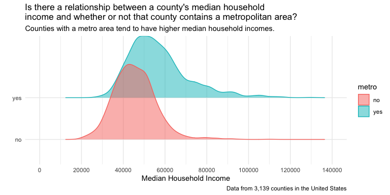

# KEY Tutorial 4: EDA with Numerical Data
Mr. Adams

- [Up to this point, you’ve explored data that is either numerical or
  categorical. Here, you will expand the scope of questions you can
  explore by comparing numerical data across different
  groups.](#up-to-this-point-youve-explored-data-that-is-either-numerical-or-categorical.-here-you-will-expand-the-scope-of-questions-you-can-explore-by-comparing-numerical-data-across-different-groups.)
- [By the end of this tutorial, you should be able
  to…](#by-the-end-of-this-tutorial-you-should-be-able-to)
- [1: Load the libraries](#load-the-libraries)
- [2: Load and learn about the data](#load-and-learn-about-the-data)
  - [2.1: Tasks and Questions](#tasks-and-questions)
- [3: Ask statistical questions that lead you to explore numerical data
  across different
  groups](#ask-statistical-questions-that-lead-you-to-explore-numerical-data-across-different-groups)
  - [3.1: Tasks and Questions](#tasks-and-questions-1)
- [4: Build box plots and generate the supporting
  statistics](#build-box-plots-and-generate-the-supporting-statistics)
  - [4.1: Build the box plot](#build-the-box-plot)
    - [4.1: Tasks and Questions](#tasks-and-questions-2)
  - [4.2: Generate the statistics to support what’s shown in the box
    plot.](#generate-the-statistics-to-support-whats-shown-in-the-box-plot.)
    - [4.2 Tasks and Questions](#tasks-and-questions-3)
  - [4.3 Answer your question and consider what you’re
    missing.](#answer-your-question-and-consider-what-youre-missing.)
    - [4.3 Tasks and Questions.](#tasks-and-questions.)
- [5. Build faceted histograms.](#build-faceted-histograms.)
  - [5.1a: Tasks and Questions](#a-tasks-and-questions)
  - [5.1b: Tasks and Questions](#b-tasks-and-questions)
- [6: Build a Ridge Plot](#build-a-ridge-plot)
  - [6: Tasks and Questions](#tasks-and-questions-4)
- [7 - Bonus: Two Numerical Variables and a Categorical
  Variable](#bonus-two-numerical-variables-and-a-categorical-variable)
  - [7 - Bonus: Tasks and Questions](#bonus-tasks-and-questions)

## Up to this point, you’ve explored data that is either numerical or categorical. Here, you will expand the scope of questions you can explore by comparing numerical data across different groups.

Let’s get after it.

# By the end of this tutorial, you should be able to…

# 1: Load the libraries

As always, run the library code first.

``` r
library(tidyverse)
```

    ── Attaching core tidyverse packages ──────────────────────── tidyverse 2.0.0 ──
    ✔ dplyr     1.1.3     ✔ readr     2.1.4
    ✔ forcats   1.0.0     ✔ stringr   1.5.1
    ✔ ggplot2   3.4.4     ✔ tibble    3.2.1
    ✔ lubridate 1.9.3     ✔ tidyr     1.3.0
    ✔ purrr     1.0.2     
    ── Conflicts ────────────────────────────────────────── tidyverse_conflicts() ──
    ✖ dplyr::filter() masks stats::filter()
    ✖ dplyr::lag()    masks stats::lag()
    ℹ Use the conflicted package (<http://conflicted.r-lib.org/>) to force all conflicts to become errors

``` r
library(openintro)
```

    Loading required package: airports
    Loading required package: cherryblossom
    Loading required package: usdata

``` r
library(skimr)
library(ggridges)
library(knitr)
```

# 2: Load and learn about the data

Throughout this tutorial, the data frame you will explore, named
*`county`*, is referenced in our textbook, *I[ntroduction to Modern
Statistics](https://openintro-ims.netlify.app/index.html)*, and is
included in the `openintro` package.

## 2.1: Tasks and Questions

1.  Run the code chunk below.

2.  What is the name of the data frame?

    `county`

3.  What are the observational units and how many are there?

    The observations are the 3,142 counties in the United States

4.  How many numerical variables are there in this data frame?

    There are 10 numerical variables.

5.  How many categorical variables are there in this data frame?

    There are 5 numerical variables.

``` r
?county
glimpse(county)
```

    Rows: 3,142
    Columns: 15
    $ name              <chr> "Autauga County", "Baldwin County", "Barbour County"…
    $ state             <fct> Alabama, Alabama, Alabama, Alabama, Alabama, Alabama…
    $ pop2000           <dbl> 43671, 140415, 29038, 20826, 51024, 11714, 21399, 11…
    $ pop2010           <dbl> 54571, 182265, 27457, 22915, 57322, 10914, 20947, 11…
    $ pop2017           <int> 55504, 212628, 25270, 22668, 58013, 10309, 19825, 11…
    $ pop_change        <dbl> 1.48, 9.19, -6.22, 0.73, 0.68, -2.28, -2.69, -1.51, …
    $ poverty           <dbl> 13.7, 11.8, 27.2, 15.2, 15.6, 28.5, 24.4, 18.6, 18.8…
    $ homeownership     <dbl> 77.5, 76.7, 68.0, 82.9, 82.0, 76.9, 69.0, 70.7, 71.4…
    $ multi_unit        <dbl> 7.2, 22.6, 11.1, 6.6, 3.7, 9.9, 13.7, 14.3, 8.7, 4.3…
    $ unemployment_rate <dbl> 3.86, 3.99, 5.90, 4.39, 4.02, 4.93, 5.49, 4.93, 4.08…
    $ metro             <fct> yes, yes, no, yes, yes, no, no, yes, no, no, yes, no…
    $ median_edu        <fct> some_college, some_college, hs_diploma, hs_diploma, …
    $ per_capita_income <dbl> 27841.70, 27779.85, 17891.73, 20572.05, 21367.39, 15…
    $ median_hh_income  <int> 55317, 52562, 33368, 43404, 47412, 29655, 36326, 436…
    $ smoking_ban       <fct> none, none, partial, none, none, none, NA, NA, none,…

# 3: Ask statistical questions that lead you to explore numerical data across different groups

As you know, questions appear at the top of our statistics wheel. You
then collect data, create visualizations, and generate statistics to
help you answer your questions. Being able to ask good statistical
questions is a key element to your work as a statistician and data
scientist. Like any skill, you need to practice to develop your
abilities! Let’s do that now.

## 3.1: Tasks and Questions

1.  Write down a question that would require you to explore one
    numerical variable and one categorical variable from this dataset.

    How does the poverty rate in counties that contain a metropolitan
    area compare to those counties that do not have a metropoloitan
    area?

2.  What is the name of each variable? Be sure to write each name
    EXACTLY as it appears in the data frame.

    numerical variable = `poverty`

    categorical variable = `metro`

3.  Write down a second question that would require you to explore one
    numerical variable and one categorical variable.

    Is there an association between a county’s median education level
    and median household income?

4.  What is the name of each variable? Be sure to write each name
    EXACTLY as it appears in the data frame.

    numerical variable = `median_hh_income`

    categorical variable = `median_edu`

5.  Call Mr. Adams over to discuss the questions you just wrote
    questions.

# 4: Build box plots and generate the supporting statistics

Displaying multiple box plots is a way to construct a visualization to
compare numerical data distributions across different levels of a
categorical variable. In this section of the tutorial, you will begin to
explore the questions you asked above by creating box plots.

## 4.1: Build the box plot

As you work through the tasks and questions, you will reference **one**
of the questions you wrote in part 3.1.

### 4.1: Tasks and Questions

1.  Replace `NAME_OF_DATA_FRAME`, `NUMERICAL_VARIABLE`,
    `CATEGORICAL_VARIABLE`.

    *\*\***Note:** The second line of this code tells the computer to
    filter or take out any cells that do not have a number. When a cell
    in your data frame is empty, it will automatically be filled with
    NA. The code you read there filters out any cell in the column of
    the variable you’ve defined that has NA in it)*

2.  Run the code.

3.  Add layers to this code to improve the title and labels on each axis
    and make it have the `theme_minimal`.

``` r
county |>
  filter(!is.na(poverty),!is.na(metro) ) |>
  ggplot(aes(x = poverty, y = metro, color = metro)) +
  geom_boxplot()
```


## 4.2: Generate the statistics to support what’s shown in the box plot.

Once again, we need to generate statistics to provide more information
about the visualization.

To do this, we need to use a few functions used to **wrangle our data**.

The three functions are:

- `filter`

- `group_by`

- `select`

**`filter`**: Think of this function like the options you have when you
are online shopping that allow you to narrow down the scope of products
you’d like to see. You do not always need to use this. We use it in this
case because we do not want to include any cells in our numerical
variable column that have an NA.

**`group_by`**: This function tells the computer to group all of the
observations that share the same level. Think of this as if you were
standing on the stage at all school and said, “Everyone, middle school
students group together and upper school students group together.” Once
they are grouped then your, or in this case the computer, can do thinks
with each of those groups separately.

**`select`**: This tells the computer, “Hey, I know you have a ton of
variables in this data frame, but I just want this/these specific
variable(s).” You can also select multiple variables by just listing
them with commas in between them.

### 4.2 Tasks and Questions

1.  Replace `NAME_OF_DATA_FRAME`, `NUMERICAL_VARIABLE`,
    `CATEGORICAL_VARIABLE` to generate the statistics that support the
    box plots you made in the previous section.

2.  Run the code.

``` r
county |>
  filter(!is.na(poverty), !is.na(metro)) |>
  group_by(metro) |>
  select(poverty) |>
  skim()
```

    Adding missing grouping variables: `metro`

|                                                  |           |
|:-------------------------------------------------|:----------|
| Name                                             | select(…) |
| Number of rows                                   | 3139      |
| Number of columns                                | 2         |
| \_\_\_\_\_\_\_\_\_\_\_\_\_\_\_\_\_\_\_\_\_\_\_   |           |
| Column type frequency:                           |           |
| numeric                                          | 1         |
| \_\_\_\_\_\_\_\_\_\_\_\_\_\_\_\_\_\_\_\_\_\_\_\_ |           |
| Group variables                                  | metro     |

Data summary

**Variable type: numeric**

| skim_variable | metro | n_missing | complete_rate |  mean |   sd |  p0 |  p25 |  p50 |  p75 | p100 | hist  |
|:--------------|:------|----------:|--------------:|------:|-----:|----:|-----:|-----:|-----:|-----:|:------|
| poverty       | no    |         0 |             1 | 17.00 | 6.88 | 2.6 | 11.9 | 16.0 | 20.9 | 52.0 | ▅▇▂▁▁ |
| poverty       | yes   |         0 |             1 | 14.23 | 5.42 | 2.4 | 10.3 | 13.9 | 17.5 | 37.5 | ▃▇▅▁▁ |

## 4.3 Answer your question and consider what you’re missing.

You’ve created a visualization and generated summary stats. Time to
start making sense of what they tell you.

### 4.3 Tasks and Questions.

1.  Using information learned through your box plots and the statistics
    you generated, answer the question you asked. **\*\*\***Be sure to
    comment on and compare the **shapes, center, and variability** using
    **statistical vocabulary** and **relevant statistics** in your
    answer.

    While the distribution of poverty rates in counties that contain and
    do not contain a metropolitan area are both skewed to the right, the
    counties that have a metro area tend to have a lower poverty rate
    (median = 13.9) than counties without a metropolitan area (median =
    16). The counties without a metropolitan area also have a wider
    spread of poverty rates as the middle 50% of poverty rates in those
    counties falls from 11.9 to 20.9.

2.  Despite learning information to help answer your questions, what
    information might you be missing from the visualization you created?
    In other words, what aspects of the distribution might not be easily
    seen in a box blot. List at least two pieces of information.

    Might either of these distributions be multi-modal?

    We also don’t get a sense of how many counties are in each group.

3.  What is another visualization that could help you uncover those
    missing pieces of information?

    To see if the distributions is multi-modal and to compare the number
    of counties in each group, we can create a histogram for each
    distribution.

# 5. Build faceted histograms.

Because you realized that the box plots might be hiding key insights,
you’ll want to pop up other visualizations that will help you see if
there is more information to uncover in the data. Once you have both
visualizations created, you can determine which one best communicates
the story in the data.

You will now create a **histogram for each level** of your categorical
variable and stack them above and below one another.

For this section, you will continue to **use the same variables you used
in part 4**.

## 5.1a: Tasks and Questions

1.  Replace `NAME_OF_DATA_FRAME` and `NUMERICAL_VARIABLE` in the code
    chunk below question 4 in this section.

2.  The last line of code (written in the code chunk below question 4 of
    this section) is going to do the stacking or **faceting**. You want
    to **facet it by the categorical** variable and then make the
    **number of rows** equal to the number of **levels**. If you don’t
    know the number of levels use the code chunk below.

    ``` r
    county |>
      filter(!is.na(metro)) |>
      select(metro) |>
      group_by(metro) |>
      count(metro)
    ```

        # A tibble: 2 × 2
        # Groups:   metro [2]
          metro     n
          <fct> <int>
        1 no     1974
        2 yes    1165

    ``` r
    1974+1165
    ```

        [1] 3139

Change `CATEGORICAL_VARIABLE` , `NUMBER_OF_LEVELS` , and `BIN_WIDTH`

3.  Run the code.

4.  Add layers to this code to improve the title and labels on each axis
    and make it have the theme_minimal.

``` r
 county |>
  filter(!is.na(poverty) & !is.na(metro)) |>
  ggplot(aes(x = poverty)) +
  geom_histogram(binwidth = 2.5) +
  facet_wrap(~metro, nrow = 2)
```


## 5.1b: Tasks and Questions

1.  Did you learn anything new about the distributions by looking at the
    visualizations you created? If so, explain.

    I learned that there are more counties that do not have metropolitan
    areas.

2.  What new questions does this information raise?

    Why might counties without metropolitan areas tend to have higher
    poverty rates?

3.  Call Mr. Adams over to chat through your work on the tutorial thus
    far.

# 6: Build a Ridge Plot

A ridge plot is one more way to visualize distributions across different
groups.

For this part of the tutorial, we will explore the question:

**Is there a relationship between a county’s median household income and
whether or not that county contains a metropolitan area?**

## 6: Tasks and Questions

1.  Which variables would we need to use to explore that question? Type
    the names of the variables EXACTLY as they appear in the data frame
    into the code chunk below.

    `median_hh_income`

    `metro`

2.  Add in a row that filters out any `NA` values for the numerical
    variable.

3.  Run the code.

``` r
county |>
  filter(!is.na(metro) & !is.na(median_hh_income)) |>
  ggplot(aes(x = median_hh_income, 
             y = metro, 
             color = metro, 
             fill = metro)) +
  geom_density_ridges(alpha = 0.5) +
  labs(x = "Median Household Income", 
       y = "", 
       title = "Is there a relationship between a county's median household\nincome and whether or not that county contains a metropolitan area?", 
       subtitle = "Counties with a metro area tend to have higher median household incomes.",
       caption = "Data from 3,139 counties in the United States") +
  scale_x_continuous(limits = c(0, 140000), breaks = seq(0, 140000, 20000)) +
theme_minimal()
```

    Picking joint bandwidth of 2270



What’s going on with the scales? What can you do about that? The next
few questions will help you adjust the scales.

5.  You can learn more about what may be going on with the scales by
    generating the statistics to support the ridge plot. Understanding
    the statistics can then help you get a sense of how you should
    adjust your axes. Run the code below to do just that.

``` r
county |>
  filter(!is.na(median_hh_income)) |>
  group_by(metro) |>
  select(median_hh_income) |>
  skim()
```

    Adding missing grouping variables: `metro`

|                                                  |           |
|:-------------------------------------------------|:----------|
| Name                                             | select(…) |
| Number of rows                                   | 3140      |
| Number of columns                                | 2         |
| \_\_\_\_\_\_\_\_\_\_\_\_\_\_\_\_\_\_\_\_\_\_\_   |           |
| Column type frequency:                           |           |
| numeric                                          | 1         |
| \_\_\_\_\_\_\_\_\_\_\_\_\_\_\_\_\_\_\_\_\_\_\_\_ |           |
| Group variables                                  | metro     |

Data summary

**Variable type: numeric**

| skim_variable    | metro | n_missing | complete_rate |     mean |       sd |    p0 |      p25 |   p50 |   p75 |   p100 | hist  |
|:-----------------|:------|----------:|--------------:|---------:|---------:|------:|---------:|------:|------:|-------:|:------|
| median_hh_income | no    |         0 |             1 | 45544.11 | 10104.41 | 19264 | 38760.75 | 44892 | 51419 | 110190 | ▂▇▂▁▁ |
| median_hh_income | yes   |         0 |             1 | 56907.71 | 14557.22 | 26346 | 46784.00 | 54150 | 63171 | 129588 | ▃▇▂▁▁ |
| median_hh_income | NA    |         0 |             1 | 61750.00 |       NA | 61750 | 61750.00 | 61750 | 61750 |  61750 | ▁▁▇▁▁ |

6.  Now that you have the summary statistics, go back up to the code you
    wrote to generate the ridge plot and define the scale for the
    x-axis. Once changed, run the code again.

7.  Add layers to this code to improve the title and labels on each axis
    and make it have the `theme_minimal`.

8.  Describe the distributions you just created. Be sure to comment on
    and compare the shape, center, and variability of the distributions.

    Counties with metro areas tend to have higher median household
    incomes (median = \$54,150) than those counties without a metro area
    ((median = \$44,892). The counties with metro areas also have a
    wider range in median incomes, which is evident from the middle 50%
    of median incomes raning from 46,784 to 63,63,171. There are a few
    counties with metro areas that have particularly high median incomes
    which makes the distribution have a shape that is skewed to the
    right. On the other hand, distribution of median household incomes
    the counties without a metro area are more symmetrical around the
    mean (45,5544.11) and tend to fall roughly within 10,104.41 of that
    mean.

# 7 - Bonus: Two Numerical Variables and a Categorical Variable

For this part of the tutorial, we will explore the following question:

Is there an association between the homeownership rate, poverty rate,
and whether the county contains a metropolitan area?

## 7 - Bonus: Tasks and Questions

1.  What are the three variables we will need to explore this question?
    Label the variable that is the response variable. Type the names
    EXACTLY as they appear in the county data frame.

2.  Replace `NAME_OF_DATA_FRAME`, `CATEGORICAL_VARIABLE`,
    `NUMERICAL_VARIABLE_X`, `NUMERICAL_VARIABLE_RESPONSE` with the
    appropriate variable names. (Hint: You will want home ownership on
    the y-axis)

3.  Run the code.

4.  Looking at the visualization you created, answer the following:

What do you notice?

What do you wonder?

5.  You’ve now **crushed 4 challenging coding tutorials** and are well
    on your way to being a pro! Turn on your favorite pump up song,
    **turn up the volume on your computer**, and pat yourself on the
    back!

``` r
county |>
  filter(!is.na(metro)) |>
  ggplot(aes(x = poverty, y = homeownership, color = metro)) +
  geom_point(alpha = 0.25) +
  geom_smooth(method = lm) +
  theme_minimal()
```

    `geom_smooth()` using formula = 'y ~ x'


